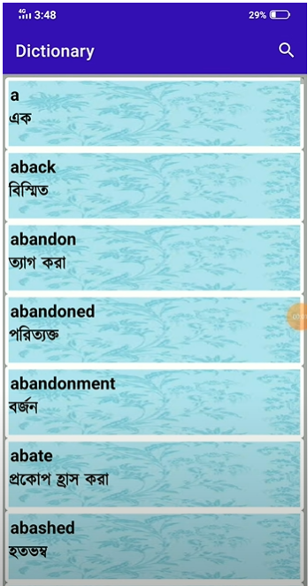
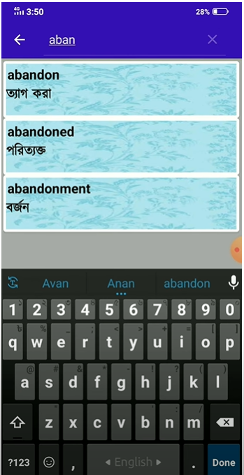

# Dictionary_App_Cse_3203_Roll_AE_15
Author: Sadnan Kibria Kawshik
* Roll-AE-15
* Assignment Topic: English to Bangla Dictionary Using Perfect Hashing
* Description: Here I used 2 2d arrays to implement 2-level hashing. My Keyset includes English Words and Bangla
* Words. So one array is used for storing Bangla words and the other array is used for storing equivalent English words.
* Here there are some collisions but it is minimal as taking the square size of the array for each slot minimizes the
* collision number to less than 1/2. The number of keys in my data set is 1000.No Firebase or SQL database is used in
* this implementation*/

## Demo: 
 

## Video Demo: https://www.youtube.com/watch?v=LLSKpqPP4Sc
